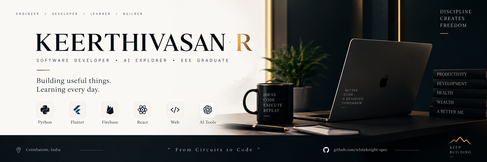
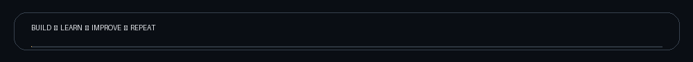

<div align="center">



<br>



### Software Developer · AI Explorer · EEE Graduate

**Building useful things. Learning every day.**

[](https://github.com/whiteknight-spec)

</div>

---

## `01 / ABOUT`

I’m **Keerthivasan R**, an EEE graduate moving from electrical engineering into software development.

I enjoy turning ideas into working applications — especially where **software, AI, automation and mobile development** meet.

> **From circuits to code. From ideas to useful products.**

---

## `02 / WHAT I BUILD`

| Area | Focus |
|---|---|
| 🧠 AI | AI-assisted applications and intelligent workflows |
| 📱 Mobile | Flutter applications |
| 🐍 Python | Programming, automation and backend projects |
| 🌐 Web | Web applications and developer tools |
| ⚙️ Automation | Practical automation and productivity solutions |

---

## `03 / SELECTED PROJECTS`

### ◉ VibeForge
**Personal transformation tracker**

Flutter-based mobile application exploring AI-assisted personal tracking and productivity.

`Flutter` `Firebase` `Gemini AI`

---

### ◉ ATS Resume Analyzer
**Resume skill-matching web application**

A web application for analysing resumes and matching technical skills using a Python/Flask backend.

`Python` `Flask` `HTML` `CSS` `JavaScript`

---

### ◉ Python Practice
**Programming fundamentals → stronger software foundations**

A growing collection of Python exercises covering core programming concepts.

`Python` `Git` `GitHub`

---

## `04 / CURRENTLY LEARNING`

```text
Python              █████████░  Advanced foundations
React               ██████░░░░  Building fundamentals
AI Development      ████████░░  Building applications
Software Engineering███████░░░  Growing
Git / GitHub         █████████░  Daily workflow
```

---

## `05 / TOOLBOX`

<p align="center">

</p>

---

## `06 / BUILD PHILOSOPHY`

<div align="center">

> **Build → Learn → Improve → Repeat**

*Small projects. Real problems. Continuous progress.*

</div>

---

## `07 / CONNECT`

<p align="center">

<a href="https://github.com/whiteknight-spec">

</a>

</p>

<div align="center">

**Thanks for visiting.**

`KEEP BUILDING.`

</div>
